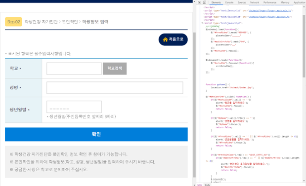
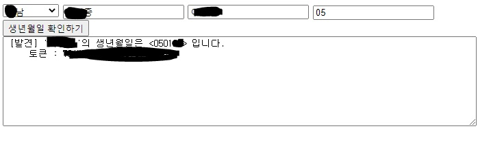

# 구 자가진단 사이트 취약점 보고서
 > 이 보고서는 VINTO가 작성하였으며 MIT 라이센스로 배포됩니다.
 > 또한 이 보고서를 악용하여 발생하는 법적 책임은 모두 당사자에게 있습니다.

 > 교육부의 권고/안내사항 및 정보통신망법 제44조의2 1항에 따라 이 취약점으로 인해 피해자가 발생할 경우, 피해자의 요청에 따라 해당 취약점이 완전히 막힐 때까지 취약점 보고서의 공개를 잠정 중단할 것을 알립니다.

🔑 취약점
============
Script의 난독화 부재
------------

   
 > Chrome Dev Tool을 통해 자가진단 페이지를 본 모습

교육부가 개발한 자가진단 홈페이지를 Chrome Dev Tool로 분석한 결과,   
Javascript 코드가 .js 파일로 따로 분리되지 않고 HTML 파일에 ```<Script>``` 태그 형식으로 내장된 것이 확인되었다.
   
또한 Javascript 코드에는 어떠한 난독화 조치도 되어있지 않았다.
   
#### 이는, 공격자가 손쉽게 페이지를 분석하고 공격할 수 있는 기회를 마련한다.

Bruteforce 방지기능의 부재
------------
Ajax를 이용해 동시에 300~400회의 ```HTTP POST Request```를 넣은 결과,
모든 요청에 대해 지연/연결 차단등의 조치 없이 응답을 반환하는 것이 확인되었다.   

300~400회의 Request에 소요된 시간은 단 **2초 이내**로 측정되었다.   
이러한 Bruteforce 차단기능의 부재는 **개인정보를 유출의 가능성을 현저히 높인다.**

SQL Injection 방어의 부재 의심
------------
취약점을 분석하는 도중 자가진단 사이트가 Sql을 사용하는 것으로 의심되는 코드(```SELECT_ERROR```)가 반환되었다.   
대부분의 사이트에서 Sql을 사용하기에 이 정보 자체는 큰 문제가 되지 않을 것으로는 보이나, ```첫번째 취약점```의 사례가 있는 만큼 **SQL Injection 취약점의 존재 가능성도 의심된다.**

🔐 취약점 시연
============
생년월일 및 자가진단 토큰 추출
------------

   
 > 본 개발자의 이름/학교명/태어난 년도를 입력하게 되자,
 > 본 개발자의 생년월일은 물론, 자가진단 조작에 필요한 토큰까지 나오게 되었다.


```2번째 취약점```을 이용한 Bruteforce 도구를 개발하여 실험한 것으로,   
특정인의 ```거주 지역```/```이름```/```학교명```/```태어난 년도(필수는 아님)```을 입력하면 **단 1~2초만에 그 사람의 생년월일과 자가진단 등록에 필요한 토큰을 추출**할 수 있다.   
   
이는 매우 심각한 상황으로,   
누군가 악의적인 목적으로 접근하여 이름/학교 정보/지역만을 통해 **해당 사용자의 개인정보**를 알아낼 수 있을 뿐만 아니라,   
   
자가진단 데이터를 조작하여 **피해자가 등교하지 못하도록 하는 등의 행위**까지도 가능해진다.

🔧 해결 방안
============
 * 자가진단 페이지의 Javascript 코드를 .js 파일로 분리하고, 난독화 과정을 거친다.
 * Bruteforce를 방지하기 위해 ```학생의 이름 별``` 분당 요청 횟수를 제한한다.
 * 또한 SQL Injection의 취약점이 의심되는 만큼 ```SQL 저장 프로시저```를 이용하거나 ```입력값 검증```을 추가한다.

🚧 현황
============
 * 2020년 9월 경, 새로 개발된 자가진단 서비스가 출시되었음에도 불구하고 현 취약점을 그대로 보유하고 있는 서비스는 유지되고 있음.
 * 2020년 10월 9일 : 국민신문고 민원을 통해 교육부에 해당 취약점을 통보함
 * 2020년 10월 20일 : 교육부 교육정보화과로부터 아래와 같은 답변을 받음 :
```
교육부 교육정보화과에서 답변드립니다.

민원인께서는 교육부 구 자가진단 사이트 대상 브루트 포스 취약점에 대해 제보하셨습니다.

평소 교육부 운영 사이트 대상으로 정보보안에 관심을 갖아주셔서 감사말씀드립니다.

민원인께서 8월경 구 자가진단 사이트에서 발견하신 브루트 포스 공격 대상 서비스는 현재 운영하지 않고 있으며, 구 사이트 접속 시 사용자 편리성을 위해 신 사이트로 자동전환 되는 기능을 제한적으로 사용하고 있습니다.
※ 신 사이트 자동전환 기능도 구 사이트 접속 사용자를 고려하여 서비스 제한(폐쇄) 예정

또한, 신 자가진단 사이트에서는 브루트 포스 공격에 대비한 SQL Injecton 방어 조치 및 소스 난독화가 적용되어 있습니다.

또한 사이트에 취약점이 존재한다 하더라도 Github에 취약점을 공개하는 부분은 해커(권한없는 자) 등이 공개된 정보를 이용하여 남의 개인정보를 확인하려는 행위 우려가 있는 점에 있어서 정보통신망법 제44조의2(정보의 삭제요청 등)제1항*이 적용될 수 있는 소지가 있음을 추가로 알려드립니다.
* 정보통신망을 통하여 일반에게 공개를 목적으로 제공된 정보로 사생활 침해나 명예훼손 등 타인의 권리가 침해된 경우 그 침해를 받은 자는 해당 정보를 처리한 정보통신서비스 제공자에게 침해사실을 소명하여 그 정보의 삭제 또는 반박내용의 게재(이하 "삭제등"이라 한다)를 요청할 수 있다.


향후 교육부 관련 사이트의 취약요소 발견 시에는 교육부 사이버안전센터로 문의 또는 신고바라며,
본 민원 관련 추가 문의사항에 대해서는
교육부 교육정보화과로 연락주시면 답변드리도록 하겠습니다.
감사합니다.
```
 * 2020년 10월 20일 : 교육부 확인결과 취약점이 적용되는 구 자가진단 사이트의 운영이 중단됨.
    * 구 사이트로 접속시 최신 자가진단 사이트로 리다이렉트
    * 단, 사이트만 접속이 불가능하고 **구 API는 여전히 동작하는 것이 확인됨**, 이는 교육부의 답변에서 밝힌 사이트 리다이렉트 조치가 무의미하다는 것을 보여줌.
    * 교육부의 답변에 따르면, 최신 자가진단 사이트에서는 SQL Injection 방어조치 및 프론트엔드 난독화 등 기본적인 보안수칙이 적용됨.
 * 2020년 10월 20일 : 교육부의 권고 및 안내사항 `정보통신망법 제44조의2(정보의 삭제요청 등)`에 따라 해당 취약점으로 인한 피해자가 발생할 경우, 피해자의 의사에 따라 취약점 공개를 잠정 중단하기로 함.